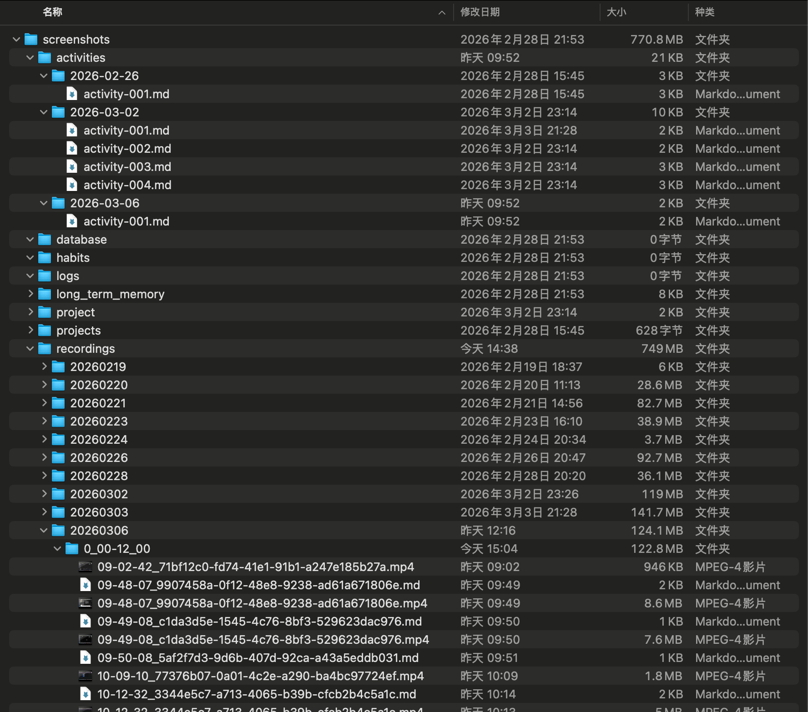
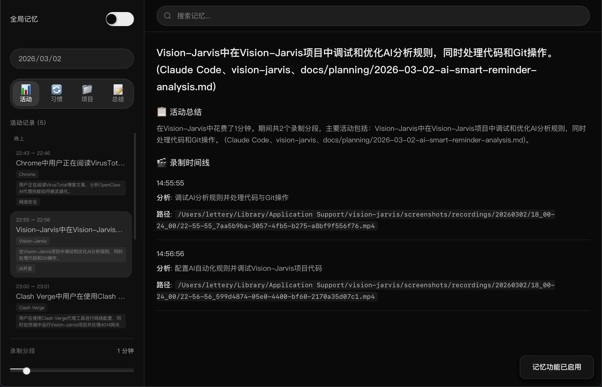
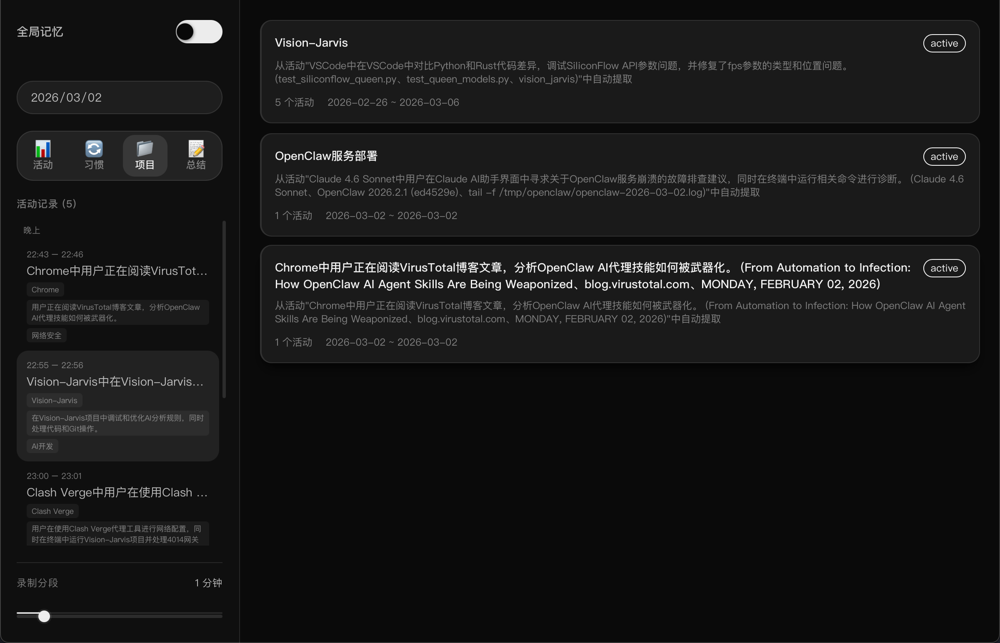
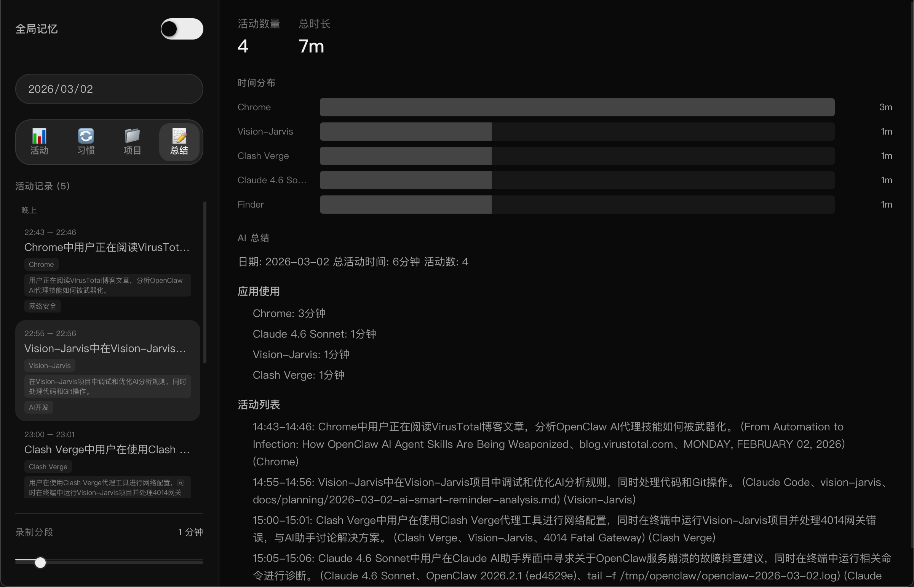
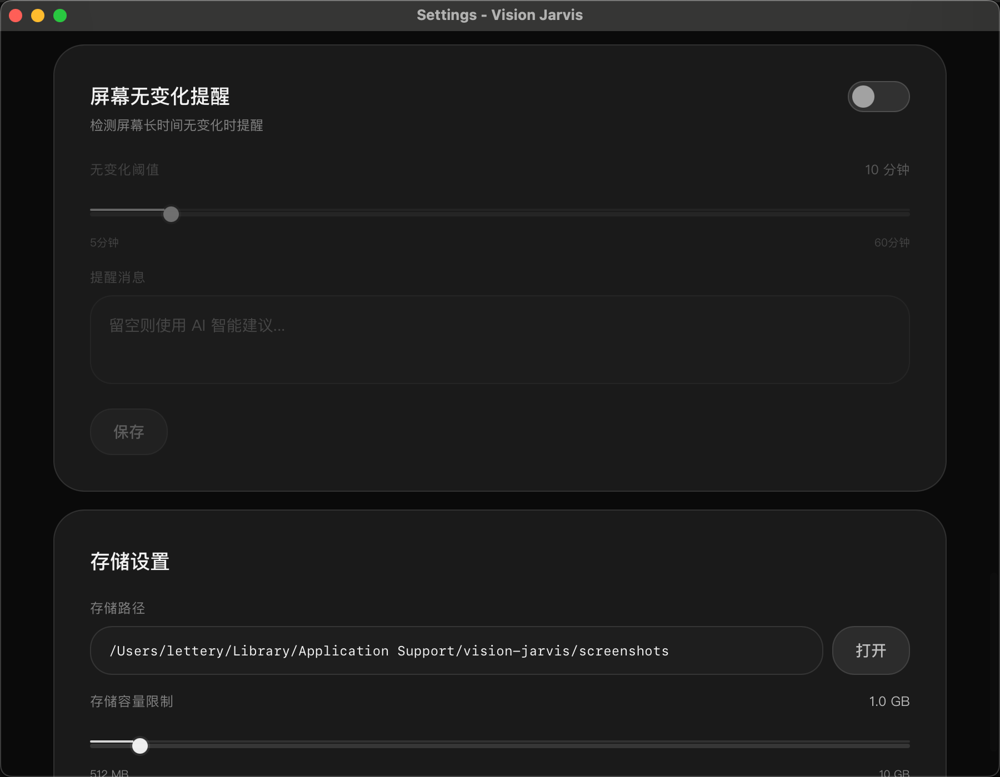
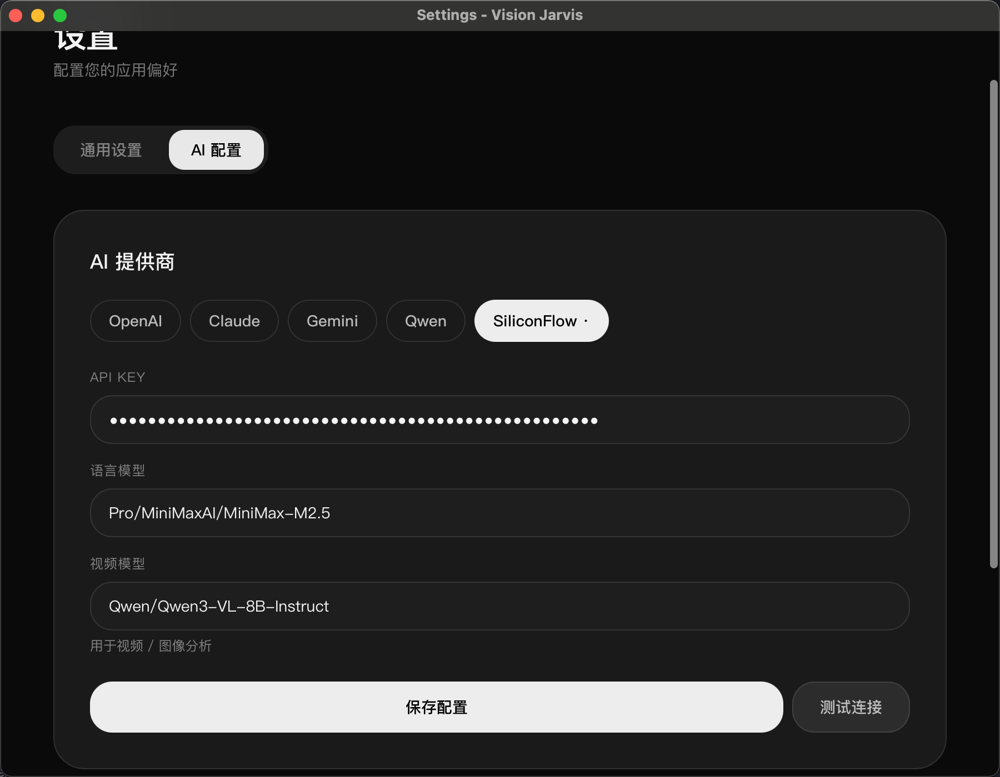

# Vision-Jarvis

> 智能记忆助手 - 自动记录和理解你的工作

Vision-Jarvis 是一个基于 AI 的桌面应用，能够自动捕获、分析和记忆你的工作活动，帮助你更好地管理时间和项目。

## 核心功能

### ✨记忆系统构建



### 📊 智能活动记录

- 自动捕获屏幕活动和应用使用情况
- 智能分析活动内容和上下文
- 按时间段分组展示（上午、下午、晚上）



### 🔄 习惯模式识别

- 自动检测工作习惯和行为模式
- 置信度评分和出现频率统计
- 帮助优化工作流程

### 📁 项目管理

- 自动识别和并根据分类持续跟踪项目进度
- 项目活动时间线
- 项目状态和进度追踪



### 📝 每日总结

- AI 生成的每日工作总结
- 时间分布可视化
- 应用使用统计



### ⚙️ 灵活配置

- API 密钥管理
- 录制间隔自定义
- 智能提醒设置



## 🚀 快速开始

### 前置要求

- macOS 10.15+
- Node.js 22+
- Rust 1.93+
- FFmpeg（通过 Homebrew 安装：`brew install ffmpeg`）
- API 密钥（OpenAI/Claude/Gemini/Qwen 等任一提供商）

### 安装

```bash
# 克隆仓库
git clone https://github.com/Stephen-creater/Vision-Jarvis-Stephen.git
cd Vision-Jarvis-Stephen/vision-jarvis

# 安装 Rust（如果未安装）
curl --proto '=https' --tlsv1.2 -sSf https://sh.rustup.rs | sh
source $HOME/.cargo/env

# 安装依赖
npm install

# 开发模式运行
source $HOME/.cargo/env && npm run tauri:dev
```

### 首次配置

1. 启动应用后，点击悬浮球打开设置
2. 在"AI 配置"中输入你的 API 密钥（视觉模型推荐使用qwen3-vl-8B-instruct，响应快，成本低，视觉理解效果与opus4.6相当）
3. 调整录制分段时长（默认 1 分钟）
4. **重要**：授予屏幕录制权限
   - 打开 **系统设置** → **隐私与安全性** → **屏幕录制**
   - 如果从 VSCode 终端启动，需要勾选 **Visual Studio Code**
   - 如果从其他终端启动，需要勾选对应的终端应用（Terminal/iTerm）
   - 授权后需要**完全重启**终端和应用（Cmd+Q 退出）



## 🎯 使用场景

- **时间追踪**: 自动记录工作时间，无需手动计时
- 
- **项目管理**: 了解每个项目的实际投入时间
- **习惯优化**: 发现并改善工作习惯
- **工作回顾**: 快速回忆某天做了什么

## 🏗️ 技术架构

- **前端**: Astro 5 + React + Tailwind CSS
- **后端**: Tauri 2 (Rust)
- **AI**: 支持 6 种提供商（OpenAI, Claude, Gemini, Qwen, AIHubMix, OpenRouter）
- **数据库**: SQLite (本地存储)
- **屏幕录制**: FFmpeg + AVFoundation
- **UI 设计**: 暗色主题 + 现代化组件

## 📁 项目结构

```
vision-jarvis/
├── src/                    # 前端源码
│   ├── pages/             # 页面路由
│   ├── components/        # UI 组件
│   └── styles/            # 样式文件
├── src-tauri/             # Rust 后端
│   ├── src/
│   │   ├── commands/      # Tauri 命令
│   │   ├── memory/        # 记忆系统
│   │   └── notification/  # 通知系统
│   └── Cargo.toml
└── public/                # 静态资源
```

## 🔒 隐私保护

- ✅ 所有数据存储在本地
- ✅ 不上传任何屏幕截图到云端
- ✅ API 密钥加密存储
- ✅ 可随时删除所有数据

数据目录：`~/Library/Application Support/VisionJarvis/`

## 🛠️ 开发

```bash
# 开发模式（热重载）
npm run tauri:dev

# 构建生产版本
npm run tauri:build

# 仅运行前端
npm run dev
```

## 📝 许可证

Apache License 2.0

---

**注意**:
- 本应用需要屏幕录制权限，首次运行时请在系统设置中授权
- 如果从终端启动，需要给**终端应用**（VSCode/Terminal/iTerm）授予屏幕录制权限
- 授权后必须完全重启终端应用（Cmd+Q）才能生效
- 推荐使用生产版本（`npm run tauri:build`）以避免权限问题
